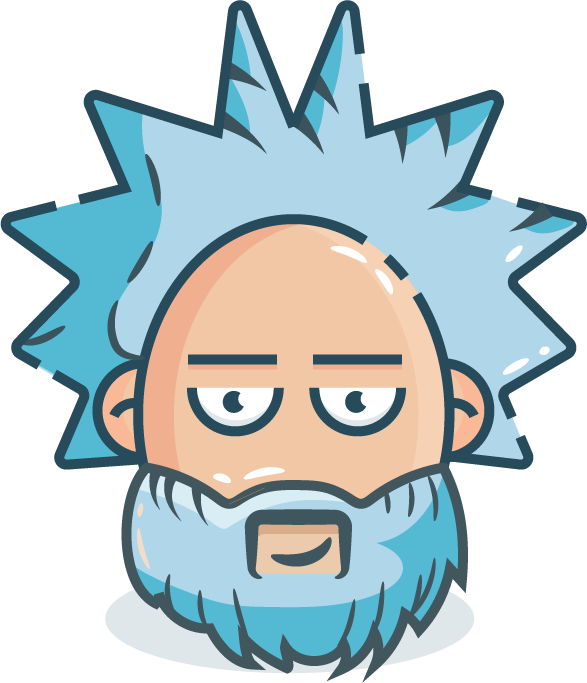

<h1 align="center">Hi 👋, I'm Abdelbari</h1>
<h3 align="center">Mobile DEV & AI engineer</h3>
<h3 align="center">Motivated and Passionate about anything with 0 and 1 in it</h3>

  

- 🔭 I’m currently working on **Flutter Apps**

- 💬 Ask me about **Flutter/Python/AI**

- 📫 How to reach me **abdelbaribouklab@gmail.com**

- 📄 Know about my experiences [https://drive.google.com/file/d/1wADxfNDCAOPr1BTeTsaoqt3ToocFDoSi/view?usp=sharing](https://drive.google.com/file/d/1wADxfNDCAOPr1BTeTsaoqt3ToocFDoSi/view?usp=sharing)

- ⚡ Fun fact **I'm a Gym rat 💪**

<h3 align="left">Connect with me:</h3>

<h3 align="left">Languages and Tools:</h3>

                   

&nbsp;

